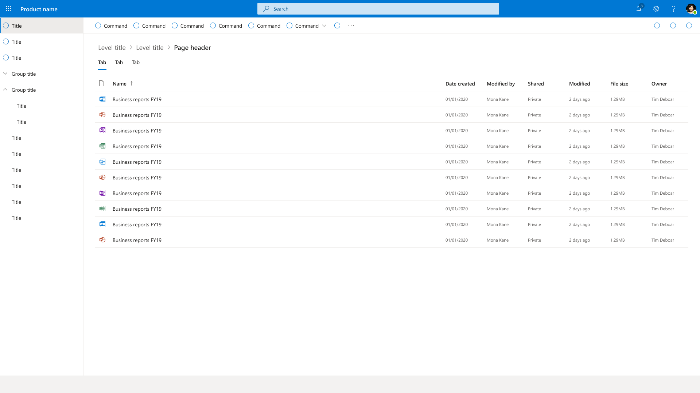

# Project to learn Fluent UI, practice React and Typescript

Fluent UI Web Controls implementation of the sample Figma Fluent UI toolkit resource provided by Microsoft.

## Demo

https://andrericardo.github.io/react-fluentui/

## Original Figma design

Uploaded copy to Figma here:
https://www.figma.com/file/7TNP96MpJ3hehby2h1enu4/Microsoft-Fluent-Web?node-id=4752%3A931

Original source:
[Figma Fluent UI toolkit resource](https://developer.microsoft.com/en-us/fluentui#/resources)

## Design decisions

- Uses the same layout as https://developer.microsoft.com/en-us/fluentui#/controls/web,
  the top header is not always visible once you scroll down.

- Every 5 reconds shows a random type of MessageBar
